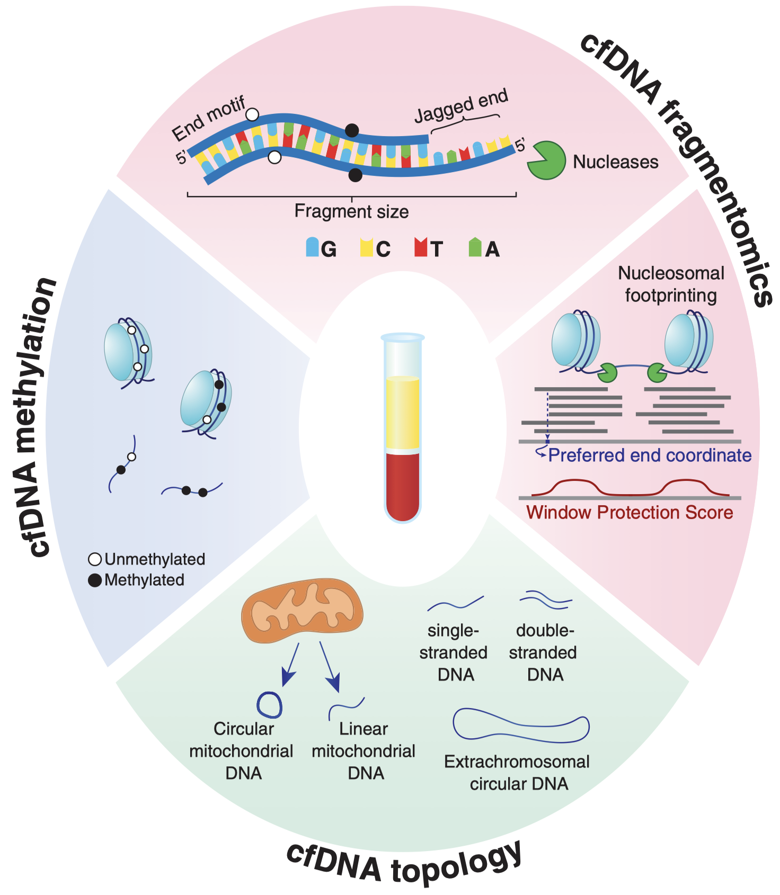

------------------------------------------------
**Still under active revision and correction !**
# Basic cfDNA-seq analyses
## 1 Background
### 1.1 A fast introduction
Circulating free DNA (**cfDNA**), also known as cell-free DNA or plasma DNA, is a crucial component in the field of liquid biopsy, particularly in the context of cancer research and diagnostics. cfDNA refers to the small fragments of DNA that are released into the biofluids (e.g.: blood) by various cells in the body, including cancerous cells. These fragments can carry genetic information that reflects the genomic alterations present in the originating cells. In cancer patients' biofluid, cancer tissue-derived cfDNA is also known as circulating tumor DNA, **ctDNA**.

In the realm of **liquid biopsy**, cfDNA has emerged as a non-invasive and promising tool for detecting cancer onset, monitoring disease progression, assessing treatment responses, and predicting prognosis. Its accessibility through a simple blood draw makes it a valuable asset for clinicians and researchers alike.

Illustration | Features (Nongenetic)
----------- | ---
 | 


### 1.2 Publication of cfDNA
A glimpse of representative publications:
- Review
  - 2019, Nat Rev | Genet, Current and future perspectives of liquid biopsies in genomics-driven oncology
  - 2021, Science, Epigenetics, fragmentomics, and topology of cell-free DNA in liquid biopsies
  - 2023, Cell Genom, Circulating DNA fragmentomics and cancer screening
- Research article
  - 2016, Cell, Cell-free DNA Comprises an In Vivo Nucleosome Footprint that Informs Its Tissues-Of-Origin
  - 2018, Nature, Sensitive tumour detection and classification using plasma cell-free DNA methylomes
  - 2018, STM, Enhanced detection of circulating tumor DNA by fragment size analysis
  - 2019, Nature, Genome-wide cell-free DNA fragmentation in patients with cancer
  - 2021, STM, Analysis of recurrently protected genomic regions in cell-free DNA found in urine
  - 2021, NC, Tissue-specific cell-free DNA degradation quantifies circulating tumor DNA burden


> more details and publications can be found at [gitbook](https://docs.ncrnalab.org/docs/literature-reading/med/2.-data-mining/cfdna), [cfDNA tencent table](https://docs.qq.com/sheet/DT0RCdEt0V3pQeVRj?tab=BB08J2), or within reviews.


### 1.3 Variation/Feature/Alteration types
We only consider **NGS** data in this repo.
#### DNA-seq (e.g. WGS)
- SNV*
- CNV*
- SV*
- WPS**
- NucleosomeFootprint**
- FragSize**
- OCF**
- EndMotif**
- MbCount***
- MtCount***

#### DIP-seq (e.g. cfMeDIP, 5hmC-SEAL)
- 5mC/5hmC MethylationCount**

#### BS-seq (e.g.: WGBS, EM-seq, TAPS)
- 5mC/5hmC MethylationRatio**
- other features in DNA-seq (theoritically)


> DIP: DNA ImmunoPrecipation sequencing 
> BS: Bisulfite-based sequencing
> DNA-seq: direct DNA sequencing
> EM-seq: Enzyme methylation sequencing
> TAPS: ...
> 
> SNV: Single Nucleotide Variation
> CNV: Copy Number Variation
> SV: Structural Variation
> WPS: Windown Protection Score
> OCF: Orientation-aware cfDNA fragmentation
> 
> *genomic level
> **epi-genomic level
> ***non-human


### 1.4 Resource
Here are some useful links/tools of cfDNA analysis:
tool | publication |  data | feature
:---:|:---:|:---:|:---:
[WPS](https://github.com/kircherlab/cfDNA) | 2016, Cell | WGS | WPS
[ichorCNA](https://github.com/broadinstitute/ichorCNA) | 2017, Nature Communications | WGS,WES | CNV,TF
[cfDNApipe](https://github.com/XWangLabTHU/cfDNApipe) | 2021, Bioinformatics | WGS,WGBS | QC,SNV,FragSize,OCF,CNV,DMR,Deconv,Mb
[CRAG](https://github.com/epifluidlab/cragr) | 2022, Genome Medicine | WGS | IFS
[Griffin](https://github.com/adoebley/Griffin) | 2022, Nature Communications | WGS | GC-corrected coverage 
[TritonNP](https://github.com/GavinHaLab) | 2023, Cancer Discovery | WGS | NucleosomePhasingScore,FragLengthEntropy
[GEMINI](https://github.com/cancer-genomics/gemini_wflow) | 2023, Nature Genetics | WGS | SNV
[cfDNAPro](https://github.com/hw538/cfDNAPro) | R pkg: Bioconductor | WGS | QC

> TF: Tumor Fraction (ctDNA/cfDNA)
> QC: cfDNA quality control cfDNA fragments size distribution with 10 bp periocity and 167 bp peak et al.
> DMR: Diff Methy Region
> Deconv: Methy-based deconvolution
> IFS: integrated fragmentation scores, calculated by weighted counts each sliding bin


----------------
## 2 Config global environment
### 2.1 Clone the repo
```sh
git clone https://github.com/hunnngry/cfDNA-NGS-analysis.git
```

### 2.2 Create conda global environment
```sh
cd cfDNA-NGS-analysis
# The default conda solver is a bit slow and sometimes has issues with selecting the special version packages. We recommend to install mamba as a drop-in replacement
## install mambaforge (mamba included)
curl -L -O "https://github.com/conda-forge/miniforge/releases/latest/download/Mambaforge-$(uname)-$(uname -m).sh"
bash Mambaforge-$(uname)-$(uname -m).sh
export PATH=~/mambaforge/bin:$PATH # you can add this line to ~/.bashrc

# create the cfDNA base environment  
mamba env create --name cfDNA_base --file ./envs/cfDNA_base.yml 
source activate cfDNA_base
```


----------------
## 3 Run upstream pipeline
**Notes**
- path of inhouse annotation dir (gencode v27): /BioII/lulab_b/baopengfei/projects/exOmics/DIP-seq/ref
- path of inhouse bowtie2 index: /BioII/lulab_b/baopengfei/projects/exOmics/DIP-seq/genome/bowtie2-index
- path of inhouse bwa-mem2 index: /BioII/lulab_b/baopengfei/projects/exOmics/DNA-seq/genome/bwa-mem2-index
- whole pipeline for **DIP-seq**: ./DIP-seq/snakemake/DIP-seq-pe.snakemake 
- whole pipeline for **BS-seq**: ./BS-seq/snakemake/BS-seq-pe.snakemake
- whole pipeline for **DNA-seq**: ./DNA-seq/snakemake/DNA-seq-pe.snakemake
- other meta tables: [https://docs.qq.com/sheet/DT0NYU1Zxa2dBSnlq?tab=f8m6qf](https://docs.qq.com/sheet/DT0NYU1Zxa2dBSnlq?tab=f8m6qf) 


### 3.1 DNA-seq
For Paried-End WGS et al., the graph of pipeline (two samples) can be seen at ./DNA-seq/DAG
```bash
cd  ./DNA-seq
dst="test" # we show a dataset example named "test"

# prepare input fastq
ls ./data/${dst}/fastq/*.fastq.gz

# prepare config file 
vi ./config/${dst}.yaml

# prepare meta dir
vi ./data/${dst}/meta_data/sample_table.txt

# opt1: submit to slurm cluster
sbatch ./run/${dst}.sh

# opt2: run in local
snakemake --rerun-incomplete --keep-going --printshellcmds --reason \
  --use-conda --nolock --latency-wait 200 --restart-times 1 --jobs 16 \
	--snakefile snakemake/DNA-seq-pe.snakemake \
	--configfile config/${dst}.yaml \
	> log/${dst}/run-${dst}.log 2>&1
```

### 3.2 DIP-seq (need test)
For paired-End cfMeDIP et al., the graph of pipeline (two samples) can be seen at ./DIP-seq/DAG
```bash
cd  ./DIP-seq
dst="test" # we show a dataset example named "test"

# prepare config file
vi ./config/${dst}.yaml

# prepare meta dir
vi ./data/${dst}/meta_data/sample_table.txt

# opt1: submit to slurm cluster
sbatch ./run/${dst}.sh

# opt2: run in local
snakemake --rerun-incomplete --keep-going --printshellcmds --reason \
  --use-conda --nolock --latency-wait 200 --restart-times 1 --jobs 16 \
	--snakefile snakemake/DIP-seq-pe.snakemake \
	--configfile config/${dst}.yaml \
	> log/${dst}/run-${dst}.log 2>&1
```

### 3.3 BS-seq (need test)
For paired-End WGBS et al., the graph of pipeline (two samples) can be seen at ./BS-seq/DAG
```bash
cd  ./BS-seq
dst="test" # we show a dataset example named "test"

# prepare config file
vi ./config/${dst}.yaml

# prepare meta dir
vi ./data/${dst}/meta_data/sample_table.txt

# opt1: submit to slurm cluster
sbatch ./run/${dst}.sh

# opt2: run in local
snakemake --rerun-incomplete --keep-going --printshellcmds --reason \
  --use-conda --nolock --latency-wait 200 --restart-times 1 --jobs 16 \
	--snakefile snakemake/BS-seq-pe.snakemake \
	--configfile config/${dst}.yaml \
	> log/${dst}/run-${dst}.log 2>&1
```


## 4 Downstream analysis
Above upstream pipeline by snakemake will finish most basic analysis by in one command, in this part we will provide a series of personalized downstream analysis tutorial step-by-step.

### 4.0 Quality control 
* Option1: Ngs.plot: https://github.com/shenlab-sinai/ngsplot
* Option2: deeptools: https://deeptools.readthedocs.io/en/develop

Check reads distribution around specific regions (gene body). We will test **Ngs.plot (v2.61)** as example
#### prepare
```sh
# config env described in Ngs.plot github
mamba env create --name ngsplot r-base python=2.7
source activate ngsplot

# download Ngs.plot (v2.61)
wget -c https://github.com/shenlab-sinai/ngsplot/archive/refs/tags/2.61.tar.gz -O ngsplot-2.61.tar.gz
mkdir -p ~/biosoft; tar xzvf ngsplot-2.61.tar.gz -C ~/biosoft

# config global env accordingly
export NGSPLOT=~/biosoft/ngsplot-2.61
export PATH=~/biosoft/ngsplot-2.61/bin:$PATH

#also install other R pkgs that quired 
R
> install.packages("doMC", dep=T)
> install.packages("caTools", dep=T)
> #install.packages("utils", dep=T)
> install.packages("BiocManager")
> BiocManager::install( "BSgenome" )
> #BiocManager::install( "Rsamtools" )
> BiocManager::install( "ShortRead" )

# install hg38 annotation
ngsplotdb.py list  # List installed genomes.
ngsplotdb.py install ngsplotdb_hg38_76_3.00.tar.gz  # Install reference genome from a package file.

# (optional: use existing database if fail to download due to db issue)
#cp /BioII/lulab_b/baopengfei/biosoft/ngsplot/ngsplotdb_hg38_76_3.00.tar.gz ~/biosoft/ngsplot-2.61/
#cp -r /BioII/lulab_b/baopengfei/biosoft/ngsplot/database/hg38 ~/biosoft/ngsplot-2.61/database/hg38

# (optional: you may want to merge&index input bam before next step)
#samtools merge
#samtools index

# modify config file
vi config/test_ngsplot.txt
#DNA-seq/output/test/bam-sorted-deduped/CRC.bam  -1      "CRC-pool"
#DNA-seq/output/test/bam-sorted-deduped/NC.bam  -1      "NC-pool"

# plot single bam (without region filter, use default ensembl all anno)
mkdir -p test/ngsplot
ngs.plot.r -G hg38 -R genebody \
  -L 4000 \
  -LWD 5 \
  -YAS 0,0.2 \
  -C config/test_ngsplot.txt -O test/ngsplot

# check other available options
ngs.plot.r --help # https://github.com/shenlab-sinai/ngsplot/wiki/ProgramArguments101
```
e.g. output plot within output dir:


### 4.1 SNV
SNV includes single-base nucleotide variation, small insertion/deletion (INDEL<50nt) compared to reference genome.
**Tools**
* Somatic variant caller
  *	GATK Mutect2
  *	VarScan2
  *	Strelka
  *	LoFreq
  *	VariantDx
  *	SiNVICT (cfDNA, 2017, Bioinfomatics)
* germline variant caller
  * GATK HaplotypeCaller
* variant annotation
  * annovar: used with mafplot et al.
  * vep (variantEffectPredictor): used with pyclone et al.


**Notes:**
* priority: Mutect2 >= HaplotypeCaller (both have been used in cfDNA mutation variant calling).
* in required reference files, "somatic-hg38_" is actually prefix of downloaded directory，such as somatic-hg38_1000g_pon.hg38.vcf.gz, which actually means germline variant, that used for filtering before/during final somatic variant determination.
* GATK Mutect2 --germline-resource: optional germline VCF file that contains an AF (population allele frequency) INFO field. Used to get the frequency of a AF, thereby providing the prior probability that the sample carries the allele in the germline. The Broad Institute provides a version of gnomAD stripped of all fields except AF (af-only-gnomad.hg38.vcf.gz).
* GATK Mutect2 --panel-of-normals: optional VCF file of normal samples that used as a reference to filter out common sequencing artifacts and germline variants. A panel of normals is simply a vcf of blacklisted sites flagged as recurrent artifacts. The Broad Institute also provides several panels of normals (e.g.: 1000g_pon.hg38.vcf.gz), but users with a large number (n>=50) may benefit from generating their own panel with CreateSomaticPanelOfNornals.


```bash
cd ./DNA-seq
#mamba env create --name DNA --file snakemake/envs/DNA.yml # run for the first test
source activate DNA

# 1.Mutect2
dst="test"
sample_id="NC" 
gn_fa_path="/BioII/lulab_b/baopengfei/shared_reference/hg38/genome.fa" # path of genome fasta
#java_opt="--java-options -Xmx10G" # optional java options that set up mem: gatk HaplotypeCaller --java-options -Xmx10G
tmp_dir="tmp"
input_path="output/${dst}/bam-sorted-deduped-RG/${sample_id}.bam" # input path containing bam file (from streamlined smk)
output_dir="output/${dst}_stepByStep" # output directory containing vcf files
mkdir -p ${output_dir}/log/${sample_id}

gnomad_path="/BioII/lulab_b/baopengfei/projects/exOmics/DNA-seq/ref/SNV_ref/somatic-hg38_af-only-gnomad.hg38.vcf.gz" # path of genomic gnomad vcf file: https://console.cloud.google.com/storage/browser/gatk-best-practices/somatic-hg38
genome1k_path="/BioII/lulab_b/baopengfei/projects/exOmics/DNA-seq/ref/SNV_ref/somatic-hg38_1000g_pon.hg38.vcf.gz" # path of genomic genome1k vcf file: https://console.cloud.google.com/storage/browser/gatk-best-practices/somatic-hg38

## 1.1.somatic mutation calling
gatk Mutect2 \
  -R ${gn_fa_path} \
  -I ${input_path} \
  -O ${output_dir}/mutect2-vcf/${sample_id}.vcf.gz \
  --germline-resource ${gnomad_path} \
  --panel-of-normals ${genome1k_path} \
  --native-pair-hmm-threads 10 \
  --tmp-dir ${tmp_dir} > ${output_dir}/log/${sample_id}/mutect2.log 2>&1

#~25min with 16-core for test sample

## 1.2.somatic mutation filtering
gatk FilterMutectCalls \
  -R ${gn_fa_path}  \
  -V ${output_dir}/mutect2-vcf/${sample_id}.vcf.gz \
  -O ${output_dir}/mutect2-vcf-filtered/${sample_id}.vcf.gz \
  -f-score-beta 1 \
  --tmp-dir ${tmp_dir} > ${output_dir}/log/${sample_id}/mutect2-filtering.log 2>&1

## 1.3.check output
zcat ${output_dir}/mutect2-vcf-filtered/${sample_id}.vcf.gz | less -S


# 2.HaplotypeCaller 
mkdir ${output_dir}/vcf{,-filtered}
## 2.1.germline mutation calling
gatk HaplotypeCaller \
  -R ${gn_fa_path} \
  -I ${input_path} \
  -O ${output_dir}/vcf/${sample_id}.vcf.gz \
  --tmp-dir ${tmp_dir} > ${output_dir}/log/${sample_id}/haplotypeCaller.log 2>&1

#~20min with 16-core for test sample

## 2.2.germline mutation filtering
gatk VariantFiltration \
  -R ${gn_fa_path} \
  -V ${output_dir}/vcf/${sample_id}.vcf.gz \
  -O ${output_dir}/vcf-filtered/${sample_id}.vcf.gz \
  -window 35 -cluster 3 \
  --filter-name FS20 -filter "FS > 20.0" \
  --filter-name QD2 -filter "QD < 2.0" \
  --filter-name DP10 -filter "DP < 10.0" \
  --filter-name QUAL20 -filter "QUAL < 20.0" \
  --tmp-dir ${tmp_dir} > ${output_dir}/log/${sample_id}/haplotypeCaller-filtering.log 2>&1

## 2.3.check output
zcat ${output_dir}/vcf-filtered/${sample_id}.vcf.gz | less -S


#need finish processing variant-calling above for all samples before the following annotation step!


# 3.mutation annotation 
#https://github.com/mskcc/vcf2maf
#cnode
source activate maf
#need install annovar first
dst="test"
# wd="/BioII/lulab_b/baopengfei/cooperation/yinjianhua"
software="/BioII/lulab_b/baopengfei/biosoft/annovar"
ref="/BioII/lulab_b/baopengfei/biosoft/annovar/humandb/hg38"
# input="${wd}/output/wes-mutect2-FilterMutectCalls"
# output="${wd}/output/wes-mutect2-FilterMutectCalls/annotation"
input_dir="output/${dst}_stepByStep/mutect2-vcf-filtered"
output_dir="output/${dst}_stepByStep/mutect2-vcf-filtered/annotation"
mkdir -p ${output_dir}

#only select SNP using gatk SelectVariants -select-type SNP -V wes.raw.vcf -O wes.snp.vcf

## 3.1.convert
cat data/${dst}/meta_data/sample_ids.txt | while read sample_id
do
  #sample_id="NC"
  echo ${sample_id}
  perl ${software}/convert2annovar.pl \
    -format vcf4 \
    -withfreq ${input_dir}/${sample_id}.vcf.gz \
    > ${output_dir}/${sample_id}.avinput
done

## 3.2.annotation
#Gene-based Annotation
#Region-based Annotation 
#Filter-based Annotation
cat data/${dst}/meta_data/sample_ids.txt | while read sample_id
do
  #sample_id="NC"
  echo ${sample_id}
  perl ${software}/table_annovar.pl \
    ${output_dir}/${sample_id}.avinput \
    -buildver hg38 -remove -operation g,r,r -nastring . \
    -protocol ensGene,cytoBand,genomicSuperDups \
    ${ref} \
    -out ${output_dir}/${sample_id}
done
#refGene 有注释无法下载好像
#-buildver hg19 表示使用hg19版本
#-out snpanno 表示输出文件的前缀为snpanno
#-remove 表示删除注释过程中的临时文件
#-protocol 表示注释使用的数据库，用逗号隔开，且要注意顺序
#-operation 表示对应顺序的数据库的类型（g代表gene-based、r代表region-based、f代表filter-based），用逗号隔开，注意顺序
#-nastring . 表示用点号替代缺省的值
#-csvout 表示最后输出.csv文件
#-thread 表示线程数，仅集群可以用
 
## 3.3.merge files of all samplesall samples
#在上一步每个_multianno.txt最后加上sampleID列并合并所有文件
cat data/${dst}/meta_data/sample_ids.txt | while read sample_id
do
  #sample_id="NC"
  echo ${sample_id}
  grep -v '^Chr' ${output_dir}/${sample_id}.hg38_multianno.txt | cut -f 1-12 | awk -v T=${sample_id} '{print $0"\t"T}' > ${output_dir}/${sample_id}.annovar.vcf
done
 
head -1 ${output_dir}/NC.annovar.vcf > ${output_dir}/annovar_merge.vcf
tail -n +2 -q ${output_dir}/*.annovar.vcf >> ${output_dir}/annovar_merge.vcf


# 3.visualization
Rscript ./scripts/maftools.R ${output_dir}/annovar_merge.vcf \
  /BioII/lulab_b/baopengfei/shared_reference/geneset/IntOGen-Drivers-20200213/Compendium_Cancer_Genes.tsv \
  COREAD
```


### 4.2 CNV
**option1**:
```bash
cd  ./DNA-seq

## bam to count matrix
featureCounts -T 4 -O -t gene -g gene_id -M -p  \
	-a ref/gtf/gene.gtf \
	-o raw_count_matrix \
	output/lulab/bam-sorted-deduped/*.bam \
	> raw_count_matrix.log 2>&1

/usr/bin/Rscript scripts/multiFeatureCounts2countMat.R   \
        -i raw_count_matrix  \
        -o output/lulab/matrix/count_matrix_gene.txt

## count matrix to CPM matrix
/usr/bin/Rscript  scripts/run-NormCountMat.R  \
	-i  output/lulab/matrix/count_matrix_gene.txt \
	-s  meta/lulab/sample_ids.txt \
	-m  TMM  \
	-o  output/lulab/matrix/CPM-TMM_matrix_gene.txt  \
  >  output/lulab/matrix/log/NormCountMat_gene.log 2>&1

## correct GC (manually)
vi scripts/correctGC.R
```

**option2: CNVkit**
```bash
REF="genome/bwa-mem2-index/genome.fa"
workdir="./DNA-seq"
cd $workdir

## no matched normal (CRC as eg.)
cnvkit.py batch \
    output/lulab/bam-sorted-deduped-RG/CRC*.bam \
    --normal \
    --method wgs \
    -p 10 \
    --fasta ${REF} \
    --output-reference output/lulab/cnvkit/my_reference.cnn \
    --output-dir output/lulab/cnvkit \
    --scatter

## has matched normal (CRC as eg.)
cnvkit.py batch \
    output/lulab/bam-sorted-deduped-RG/CRC*.bam \
    --normal  output/lulab/bam-sorted-deduped-RG/NC*.bam \
    --method wgs \
    -p 10 \
    --fasta ${REF} \
    --output-reference output/lulab/cnvkit/my_reference.cnn \
    --output-dir output/lulab/cnvkit \
    --scatter
```

**Notes:** 

- optionally choose to remove duplicated sequences (wgs automatically calculate from genome)
- optionally choose to remove blacklist regions (--access, wgs automatically calculate from genome)
- automatically correct GC content
- If your sequencing protocol is WGS, then you don’t need a “target” BED file, but you probably do still want refFlat.txt.
- If you have no normal samples to use for the reference, you can create a “flat” reference which assumes equal coverage in all bins by using the --normal/-n flag without specifying any additional BAM files
- The GC content and repeat-masked fraction of each bin are calculated during generation of the reference from the user-supplied genome. The bias corrections are then performed in the reference and fix commands.
- BAM file must be sorted.
- hybrid capture protocols in which both on- and off-target reads can be used for copy number detection.
- if don't have normal samples. and antitargets are not really helpfull in this situation
- With no control samples (--normal), you can create a “flat” reference of neutral copy number
- Increase the “target” average bin size (--target-avg-size), e.g. to at least 1000 bases for 30x coverage, or proportionally more for lower-coverage sequencing.
- Specify a smaller p-value threshold (segment -t). For the CBS method, 1e-6 may work well. Or, try the hmm segmentation method.
- you need determine binsize when generating reference 
- If your sequencing protocol is WGS, then you don’t need a “target” BED file, you still can use the “target” BED file to limit the analysis to just the genic regions. You can get such a BED file from the [UCSC Genome Browser](https://genome.ucsc.edu/cgi-bin/hgTables), for example, and you probably do still want refFlat.txt.
- *target.bed file in wgs mode is identical to *access.bed
  "For germline samples, you can also consider bintest to find smaller alterations"
   seems we better use .call.cns或.cns (seems to lack ci-filtering, more left, which is more suitable for gene-level)
- use log2 (Log2 mean coverage depth) not depth (Absolute-scale mean coverage depth) when mapping to gene


**option3: GISTIC2**

```bash
# GISTIC2
## test inhouse
workdir="./DNA-seq"
cd $workdir

## To convert CNVkit’s .cns files to SEG
#NUMEXPR_MAX_THREADS=4 
for i in `cat meta/lulab/sample_ids.txt |grep -v CRC`
do
cnvkit.py export seg \
 --enumerate-chroms \
 -o  output/lulab/cnvkit/${i}.cns.seg \
 output/lulab/cnvkit/${i}.cns
done

## run gistic2
cd ./DNA-seq
REF="genome/bwa-mem2-index/genome.fa"
mkdir -p  output/lulab/gistic2 

## merge all samples in a project
cat  output/lulab/cnvkit/*.cns.seg | grep -v chr > output/lulab/cnvkit/allsamples.cns.seg

## run gistic2
gistic2 \
 -b output/lulab/gistic2 \
 -seg   output/lulab/cnvkit/allsamples.cns.seg \
 -refgene /BioII/lulab_b/baopengfei/shared_reference/gistic2/hg38.UCSC.add_miR.160920.refgene.mat \
 -armpeel 1 \
 -brlen 0.7 \
 -cap 1.5 \
 -conf 0.99 \
 -ta 0.1 \
 -td 0.1 \
 -genegistic 1 \
 -gcm extreme \
 -js 4 \
 -maxseg 2000 \
 -qvt 0.25 \
 -rx 0 \
 -savegene 1 
```
**Notes**:

- need config your env according to tutorial when the first installment (wechat search gistic2)
- focal_data_by_genes.txt output data is similar to the all_data_by_genes.txt output, but using only focal events with lengths greater than the focal length cutoff. This data is a gene-level table of copy number values for all samples. 
- The returned copy number values are in units (copy number - 2) so that no amplification or deletion is 0, genes with amplifications have positive values


### 4.3 SV
mavis，STAR-fusion and Manta within smk file should both be OK
```bash
# run mavis 
/BioII/lulab_b/baopengfei/projects/multi-omics-explore/scripts/mavis-fusion.sh
# run STAR-fusion
/BioII/lulab_b/baopengfei/projects/multi-omics-explore/scripts/star-fusion.sh
# run Manta
#see DNA smk file fule: prepareMantaConfig and runMantan

# get matrix & plot (eg)
#see/BioII/lulab_b/baopengfei/projects/multi-omics-explore/scripts/SV.r
```

### 4.4 WPS (Liyu)
**Notes**
- the number of fragments spanning the window minus those with an endpoint within the window 
- footprints of protein-DNA interactions(such as nucleosome positioning or TF binding) 
- the windowed protection score (WPS) of a window of size k as the number of molecules spanning the window minus those with an endpoint within the window. We assign the determined WPS to the center of the window. For 35–80 bp fragments (short fraction, S WPS), k = 16; for 120–180 bp fragments (long fraction, L-WPS), k = 120.

**Steps**
```bash
dst="lulab" 
snakemake --rerun-incomplete --keep-going --printshellcmds --reason --use-conda --nolock --latency-wait 80 --restart-times 1 --jobs 100 \
--snakefile snakefile_WPS.smk \
--configfile config/${dst}/config_small.yml \
--cluster-config config/cluster-lsf.json \
--cluster "bsub -n {cluster.threads} -J {cluster.jobname} -q {cluster.queue} -o {cluster.output} -e {cluster.error} " > log/${dst}/run-${dst}.log 2>&1
```

**Input**
- configured by the user (__samples.tsv__):
  - analysis ID
  - samples
  - path to sample .bam files
  - reference samples fro plotting
  - genome build per sample
- configured by the user (__regions.tsv__):
  - bed file containing regions of interest (e.g. TFBS), all having the same length

e.g.: 

**Output**
- table containing bp specific WPS for regions listed in bed
- line plot showing normalized WPS of multiple samples

e.g.:


### 4.5 NucleosomeFootprint (Liyu)
Calculate (relative) coverage depth at NDR (nucleosome-depleted region) in genes
- coverage depth of 3 region types can be used as gene-centric measures
  - genebody
  - -150TSS+50, 
  - -300-100exon1end
- relative read depth in a specific region as measurement (TPM/RPKM might also work), reflect this gene’s nuleosome structure 
(more read depth, more compact nucleosome structure, less gene RNA expression)
- clinical usage:
  - early detection
  - monitoring (0.5x)
  - TOO


### 4.6 FragSize
mainly adapted from **2019,Nat,Genome-wide cell-free DNA fragmentation in patients with cancer**
```bash
# get bam frag
./DNA-seq/scripts/frag/get-FragmentSizeBam.sh 

# get ratio
./DNA-seq/scripts/frag/get-FragmentSizeDepth.sh 

# join to matrix (eg)
./DNA-seq/scripts/frag/frag_size.R
```


### 4.7 EndMotif
```bash
# count motif freq.
cd  ./DNA-seq
mkdir output/lulab/motif5
for i in `cat meta/lulab/sample_ids.txt`
do
echo "start $i at `date`"
python /BioII/lulab_b/baopengfei/gitsoft/cfdna-main/cfdna_practical.py motif-analysis -b output/lulab/04bam_dedup/${i}.bam -s  False -m 4 | head -n1 | cut -d "{" -f 4 | cut -d "}" -f 1 | tr "," "\n" | tr -d " " > output/lulab/motif5/${i}_motif5.txt
done

# join outfile to matrix
#see ./DNA-seq/scripts/motif/sum-motif.Rmd
```


### 4.8 Microbe
```bash
# count motif freq.
cd  ./DNA-seq
mkdir output/lulab/motif5
for i in `cat meta/lulab/sample_ids.txt`
do
echo "start $i at `date`"
python /BioII/lulab_b/baopengfei/gitsoft/cfdna-main/cfdna_practical.py motif-analysis -b output/lulab/04bam_dedup/${i}.bam -s  False -m 4 | head -n1 | cut -d "{" -f 4 | cut -d "}" -f 1 | tr "," "\n" | tr -d " " > output/lulab/motif5/${i}_motif5.txt
done

# join outfile to matrix
#see ./DNA-seq/scripts/motif/sum-motif.Rmd
```


## 5 Appendix 
### 5.1 V-plot
#TODO


